# Controlador de cámara

## 1. Cámara con seguimiento al personaje A. Se debe configurar el seguimiento hacia adelante. Esta cámara es la que debe tener la máxima prioridad.

Se ha configurado una cámara que sólo tiene seguimiento a la derecha que es la dirección preferente. Esta cámara tiene una prioridad de 10 (por defecto)

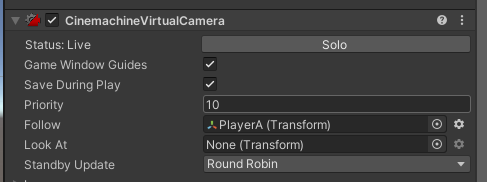
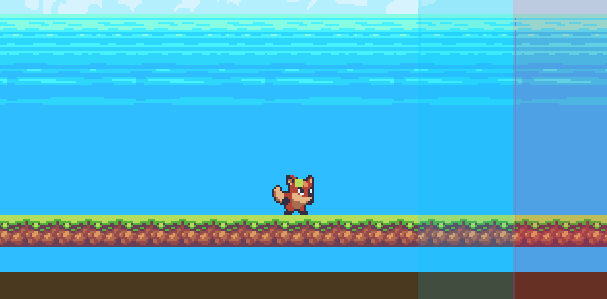

## 2. Cámara con seguimiento al personaje B. Debe configurarse una zona de seguimiento del personaje B más amplia que la de A.

Se ha configurado una cámara que tiene seguimiento en todas las direcciones. Esta cámara tiene una prioridad de 9.

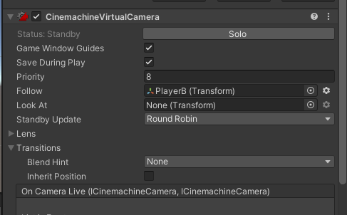
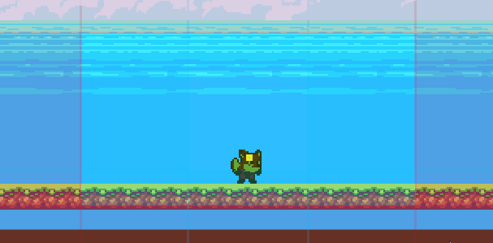

## 3. Cámara que hace el seguimiento de ambos personajes.

Se ha configurado una cámara de "TargetGroup". Esta cámara tiene una prioridad de 8 y sigue a los dos players (A y B)

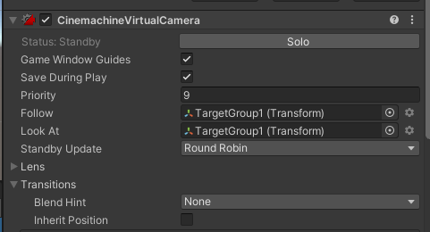
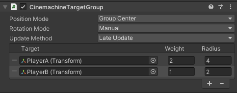
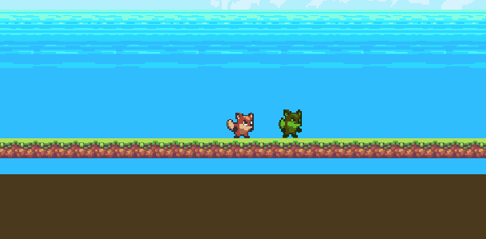

## 4. Crear una zona de confinamiento de A que abarque toda la escena.

Se ha añadido la extension Cinemachine Confiner a la cámara del player A.

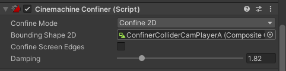
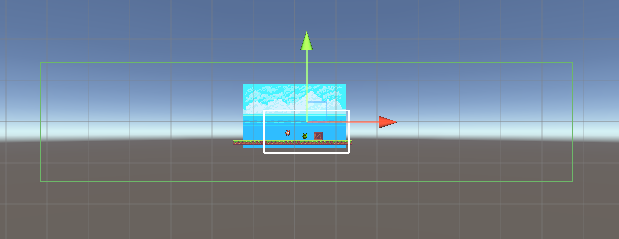

## 5. Se debe crear una zona de confinamiento de la cámara B que abarque una parte de la escena.

Se ha creado una zona de confinamiento de la misma manera que para la camara A pero con menos tamaño.

## 6. Añadir un objeto que genere una vibración en la cámara cuando A choca con el

Se ha puesto un Impulse Source sobre el playerA y que sólo afecten las colisiones de la layer "LowEnemy"

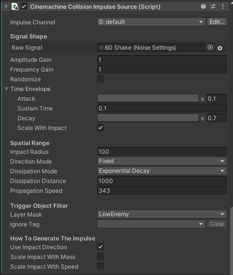

Además se ha puesto el Impulse Listener en la cámara del player A

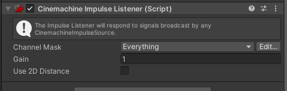

## 7. Seleccionar un conjunto de teclas que permitan hacer el cambio de la cámara de los personajes a la cámara que sigue al grupo. (Habilitar/Deshabilitar el gameobject de la cámara virtual)

Se ha usado [CameraManager.cs](Assets/Scripts/CameraManager.cs) para escoger una tecla y activar/desactivar las cámaras cuando se pulsa.

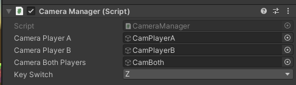
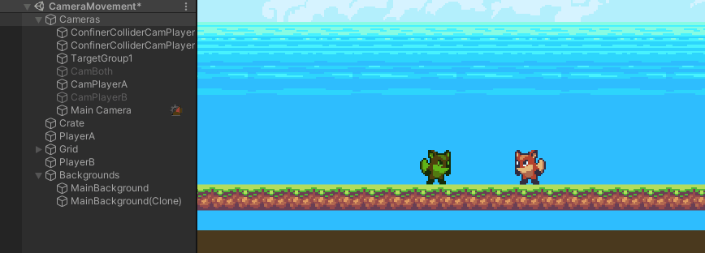